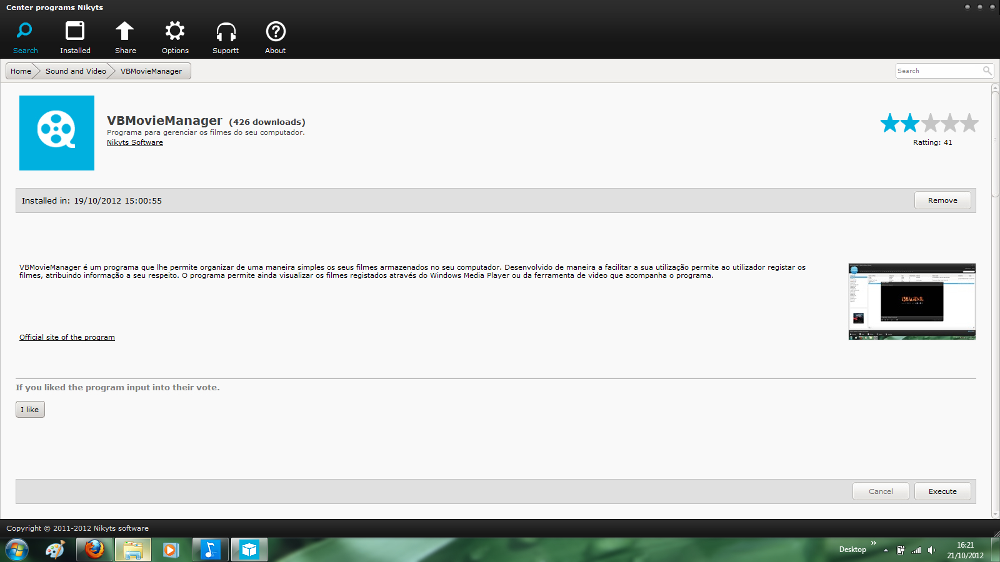



## Center programs Nikyts

### Description

Program based on Ubuntu. Through this program you can have access to all programs ever developed. Useful for programmers who have developed programs and make them available on the Internet through a single application.
 
### More Info
 

             |
---                |---
**Submitted On**   |2012-10-21 16:27:58
**By**             |[Nikyts](https://github.com/Planet-Source-Code/PSCIndex/blob/master/ByAuthor/nikyts.md)
**Level**          |Intermediate
**User Rating**    |4.3 (13 globes from 3 users)
**Compatibility**  |VB 6\.0, ASP \(Active Server Pages\) 
**Category**       |[Internet/ HTML](https://github.com/Planet-Source-Code/PSCIndex/blob/master/ByCategory/internet-html__1-34.md)
**World**          |[Visual Basic](https://github.com/Planet-Source-Code/PSCIndex/blob/master/ByWorld/visual-basic.md)
**Archive File**   |[Center\_pro22294810212012\.zip](https://github.com/Planet-Source-Code/nikyts-center-programs-nikyts__1-74220/archive/master.zip)

